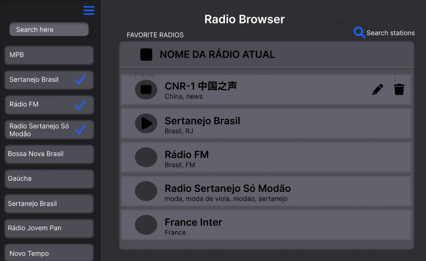
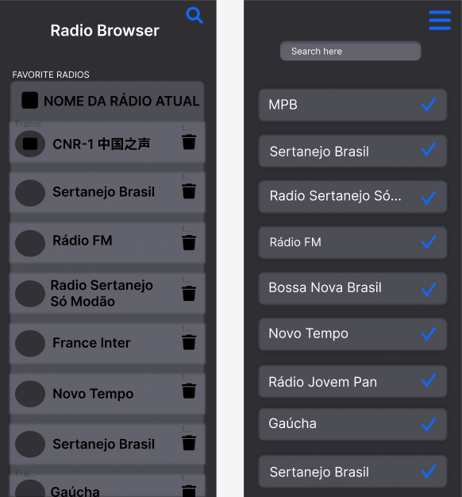

# Radio Browser

Este foi um dsafio realizado para uma vaga de Front-End. Nele eu deveria criar uma rádio online consumindo a REST API: https://de1.api.radio-browser.info/ 

Iniciei o processo estudando a API e decidindo qual CSS Framework iria utilizar. Acabei por escolher o Material UI, pois é o que tenho mais afinidade.

Utilizei a lib Axios para consumo da API.

Parti para a construção das funcionalidades inicialmente, sem se preocupar com estética, deixando todas as funções que eram obrigatórias no desafio funcionando. 

Acabei notando um erro da minha parte que foi não ter estruturado o código inicial e depois passar para a construção das funções. Isso me gerou um retrabalho, tendo que refatorar todo o código para organiza-lo.

Para re produzir e pasar, utilizei um próprio método od JS, Audio. Pensei em utilizar a tag HTML '<audio>', mas preferi criar os meus próprios botões de reprodução.

## Acessando Online

Acesse pelo link: 

[https://radio-browser.vercel.app](https://radio-browser.vercel.app)

## Rodando na sua máquina em DEV.

No diretório do projeto, abre o terminal e rode o camando:

### `npm start`

O seu navegador padrão irá abrir no [http://localhost:3000](http://localhost:3000).

# Informações sobre o desafio

### Introdução

Este é um desafio para testar seus conhecimentos de Front-end;

O objetivo é avaliar a sua forma de estruturação e autonomia em decisões para construir algo escalável utilizando o Framework sugerido na vaga aplicada.

### Antes de começar
 
- Prepare o projeto para ser disponibilizado no Github, copiando o conteúdo deste repositório para o seu (ou utilize o fork do projeto e aponte para o Github). Confirme que a visibilidade do projeto é pública (não esqueça de colocar no readme a referência a este challenge);
- O projeto deve utilizar a Linguagem específica na sua Vaga (caso esteja se candidatando). Por exempo: Python, R, Scala e entre outras;
- Considere como deadline 5 dias a partir do início do desafio. Caso tenha sido convidado a realizar o teste e não seja possível concluir dentro deste período, avise a pessoa que o convidou para receber instruções sobre o que fazer.
- Documentar todo o processo de investigação para o desenvolvimento da atividade (README.md no seu repositório); os resultados destas tarefas são tão importantes do que o seu processo de pensamento e decisões à medida que as completa, por isso tente documentar e apresentar os seus hipóteses e decisões na medida do possível.

## Case

As pessoas estão com saudades de voltar nos tempos antigos e uma das melhores maneiras de solucionar esse problema é trazer a rádio de volta.
Sua tarefa para esse case será desenvolver uma aplicação que consuma uma API de rádio para que os usuários possam desfrutar e relembrar desse tempo, seguindo os requisitos propostos neste desafio.

## Recursos

1. Estudar a documentação da REST API: https://de1.api.radio-browser.info/json/stations/search?limit=10
2. Utilizar Frameworks CSS, recomendamos alguns como:

    - Tailwind CSS: https://tailwindcss.com/
    - Material UI: https://material-ui.com/
    - Angular Material: https://material.angular.io/
    - Bootstrap: https://getbootstrap.com/
    - Bulma: https://bulma.io/
    - Outro de sua preferência

## Tela para Desktop



## Tela para Mobile



## API

Para obter os dados, utilizaremos a API do Radio Browser:

- https://de1.api.radio-browser.info/json/stations/search?limit=10

Exemplo da resposta:

```json
[
    {
    "changeuuid": "f6a6d140-c065-4e3b-9bda-3fb752148ae7",
    "stationuuid": "a25700ef-e952-4b73-8b4e-b92d938cb020",
    "serveruuid": "46ce76c5-203b-43e3-b709-5748219f9fcd",
    "name": "\tNewstalk ZB Auckland",
    "url": "https://ais-nzme.streamguys1.com/nz_002_aac",
    "url_resolved": "https://ais-nzme.streamguys1.com/nz_002_aac",
    "homepage": "https://www.newstalkzb.co.nz/",
    "favicon": "https://www.newstalkzb.co.nz/content/news/images/interface/icons/newstalkzb/apple-touch-icon.png",
    "tags": "",
    "country": "New Zealand",
    "countrycode": "NZ",
    "iso_3166_2": null,
    "state": "BOP",
    "language": "",
    "languagecodes": "",
    "votes": 41,
    "lastchangetime": "2022-05-11 08:42:03",
    "lastchangetime_iso8601": "2022-05-11T08:42:03Z",
    "codec": "AAC+",
    "bitrate": 65,
    "hls": 0,
    "lastcheckok": 1,
    "lastchecktime": "2022-08-01 16:52:00",
    "lastchecktime_iso8601": "2022-08-01T16:52:00Z",
    "lastcheckoktime": "2022-08-01 16:52:00",
    "lastcheckoktime_iso8601": "2022-08-01T16:52:00Z",
    "lastlocalchecktime": "2022-08-01 12:24:26",
    "lastlocalchecktime_iso8601": "2022-08-01T12:24:26Z",
    "clicktimestamp": "2022-08-02 08:26:09",
    "clicktimestamp_iso8601": "2022-08-02T08:26:09Z",
    "clickcount": 51,
    "clicktrend": 2,
    "ssl_error": 0,
    "geo_lat": null,
    "geo_long": null,
    "has_extended_info": false
  },
]
```

## Obrigatórios

**Obrigatório 1 -** Você deverá atender aos seguintes casos de uso:

- Como usuário, posso adicionar uma rádio na minha lista;
- Como usuário, ver minha lista de rádios adicionadas;
- Como usuário, posso remover uma rádio da minha lista;
- Como usuário posso editar informações da rádio escolhida;
- Como usuário, posso ouvir a rádio selecionado ao clicar o play;
- Como usuário, posso parar de ouvir a rádio selecionada ao clicar no stop;
- Como usuário, posso pesquisar a rádio que tenho interesse.

**Obrigatório 2 -** Filtrar por nome da rádio, país ou idioma com paginação mostrando 10 rádios por vez.

**Obrigatório 3 -** Salvar as informações para quando o usuário retornar na aplicação deve ter as rádios salvas.

**Obrigatório 4 -** Seguir a base do [wireframe](https://www.figma.com/file/TDuhDdbwdzIVQjNV3GF9Qi/Radio?node-id=0%3A1) (estilização ao seu critério)

## Extras

Além do desafio proposto temos alguns diferenciais:

**Diferencial 1 -** Escrever Unit Tests ou E2E Test. Escolher a melhor abordagem e biblioteca;

**Diferencial 2 -** Configurar Docker no Projeto para facilitar o Deploy da equipe de DevOps;

**Diferencial 3 -** Publique o projeto em alguma plataforma, como por exemplo a [Vercel](https://vercel.com/), [Netlify](https://www.netlify.com/) ou outra de sua preferência.

## Readme do Repositório

- Deve conter o título do projeto
- Uma descrição de uma frase
- Como instalar e usar o projeto (instruções)
- Não esqueça o [.gitignore](https://www.toptal.com/developers/gitignore)

## Finalização

Avisar sobre a finalização e enviar para correção em: [https://coodesh.com/review-challenge](https://coodesh.com/review-challenge)
Após essa etapa será marcado a apresentação/correção do projeto.

## Instruções para a Apresentação:

1. Será necessário compartilhar a tela durante a vídeo chamada;
2. Deixe todos os projetos de solução previamente abertos em seu computador antes de iniciar a chamada;
3. Deixe os ambientes configurados e prontos para rodar;
4. Prepara-se pois você será questionado sobre cada etapa e decisão do Challenge;
5. Prepare uma lista de perguntas, dúvidas, sugestões de melhorias e feedbacks (caso tenha).

## Suporte

Use a [nossa comunidade](https://discord.com/invite/rdXbEvjsWu) para tirar dúvidas sobre o processo ou envie uma mensagem diretamente a um especialista no chat da plataforma.
